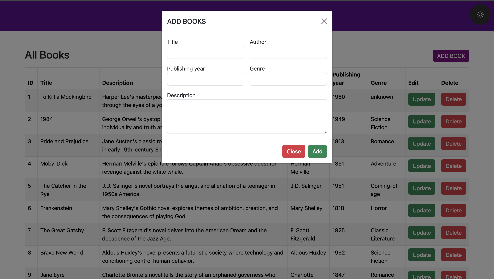

# Book Management System

This project is a simple PHP-based Book Management System designed to perform CRUD (Create, Read, Update, Delete) operations on a collection of books. It provides a user-friendly interface for adding, viewing, updating, and deleting books from a database.

## Features

1. **Add Books:** Users can add new books to the database using a modal form. The form prompts for the book's title, author, publishing year, genre, and description.

2. **View Books:** All books stored in the database are displayed in a tabular format on the main page. Each book entry includes details such as ID, title, description, author, publishing year, and genre.

3. **Edit Books:** Users can update the information of existing books by clicking on the "Update" button next to each book entry. This action redirects them to a separate page where they can modify the book's details.

4. **Delete Books:** To remove a book from the database, users can click on the "Delete" button next to the book entry. A confirmation dialog prompts the user to confirm the deletion before proceeding.
## Preview
Home
Dark Mode             |  Light Mode
:-------------------------:|:-------------------------:
  |  
  |  
  |  
  
## Files Structure

1. **index.php:** The main page of the application where all books are displayed in a table format. It also includes the modal form for adding new books.

2. **header.php:** Contains the HTML header section, including necessary CSS and JavaScript imports.

3. **footer.php:** Contains the HTML footer section, including closing tags and JavaScript imports.

4. **create_book.php:** Handles the creation of new book entries in the database. It processes the form data submitted via the modal on the main page.

5. **update_book.php:** Manages the updating of existing book entries in the database. It retrieves the book details based on the provided ID and allows users to modify them.

6. **delete_book.php:** Responsible for deleting book entries from the database. It confirms the deletion request and executes the deletion operation.

7. **style.css:** Contains custom CSS styles to enhance the appearance and layout of the application.

8. **script.js:** Implements a simple JavaScript-based toaster notification system to display success and error messages after CRUD operations. Also functions the dark and light mode toggle button.

## Installation and Setup

1. Clone or download the project files to your local machine.

2. Ensure you have a compatible PHP server environment set up, such as Apache or Nginx, with PHP and MySQL support.

3. Import the provided SQL dump file (`books.sql`) into your MySQL database to create the necessary table structure.

4. Update the database connection parameters in the PHP files (`create_book.php`, `update_book.php`, `delete_book.php`, `index.php`) to match your MySQL database credentials.

5. Launch the application by accessing the `index.php` file through your web browser.

**Note:** This project is intended as a demonstration of basic CRUD operations using PHP and MySQL. It may require additional security measures and error handling for use in production environments.
