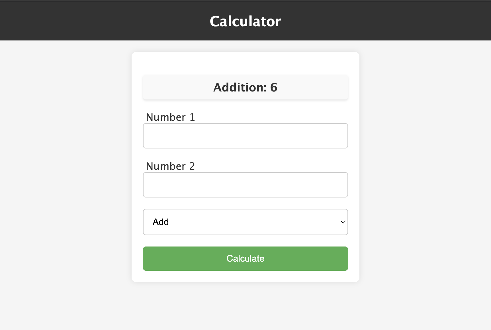

# Simple PHP Calculator

This is a simple PHP calculator web application that performs basic arithmetic operations such as addition, subtraction, multiplication, and division.



## Features

- Allows users to input two numbers and select an arithmetic operation.
- Performs the selected operation on the input numbers.
- Displays the result to the user.

## How to Use

1. Clone this repository to your local machine:

   ```bash
   git clone https://github.com/the-sankari/php_02.git
   ```

2. Navigate to the project directory:

   ```bash
   cd php_02/projects/calculator
   ```

3. Open the `index.php` file in your web browser or serve the project using a local server environment like XAMPP, WAMP, or PHP's built-in server.
4. Or
   ```bash
   php -S localhost:(port_number)
   ```
   Open the `index.php` file in your web browser
5. Enter two numbers and select an operation from the dropdown menu.

6. Click the "Calculate" button to see the result.

## Contributors

- [Kajol Sutra Dhar](https://github.com/the-sankari/)

## License

This project is licensed under the [MIT License](LICENSE).
